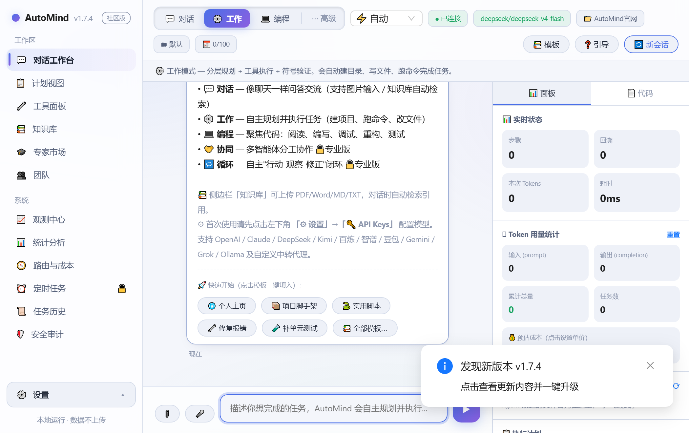
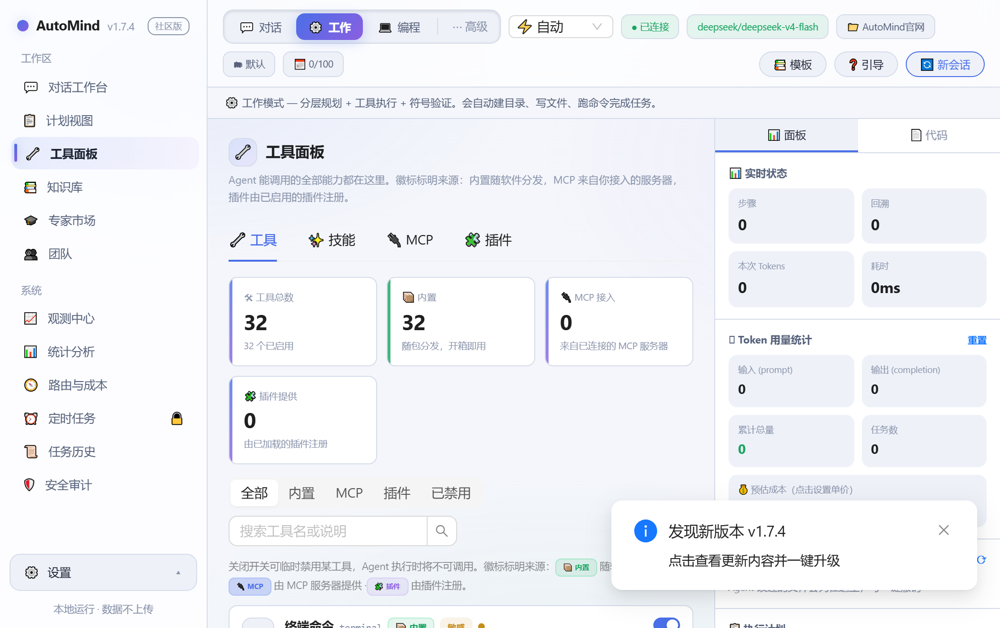
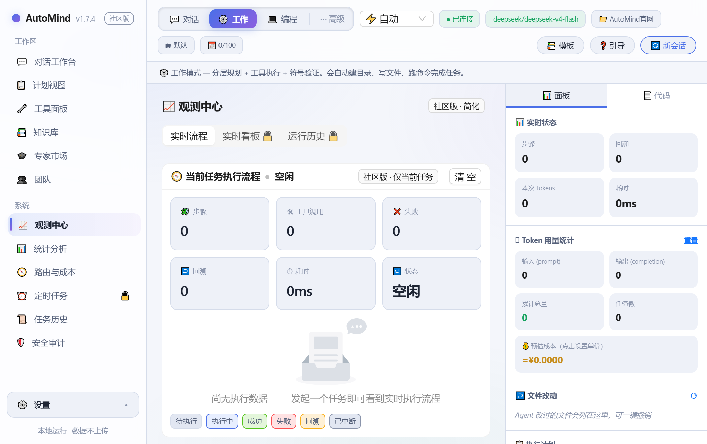
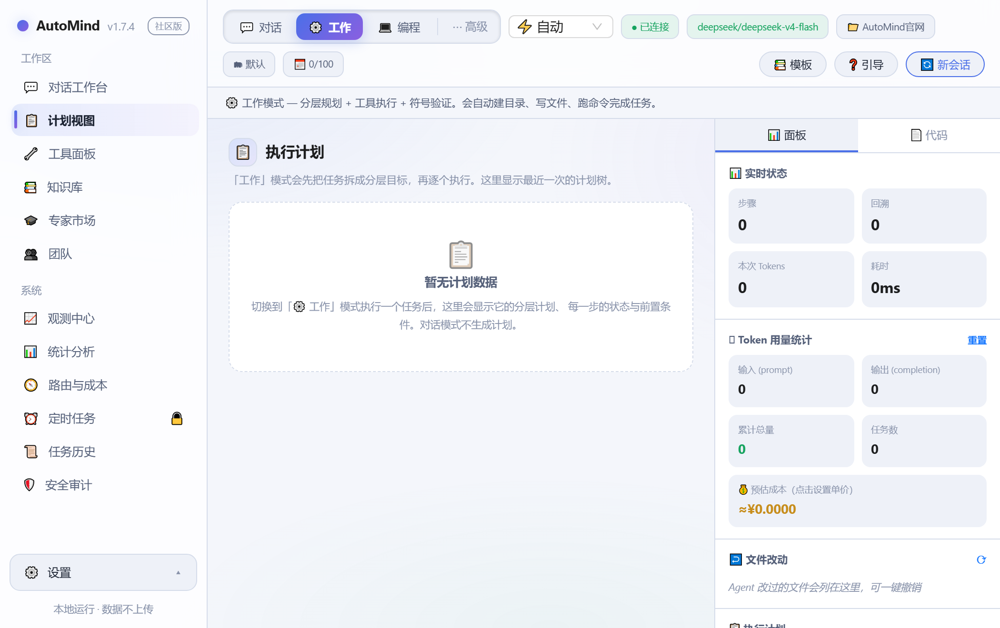
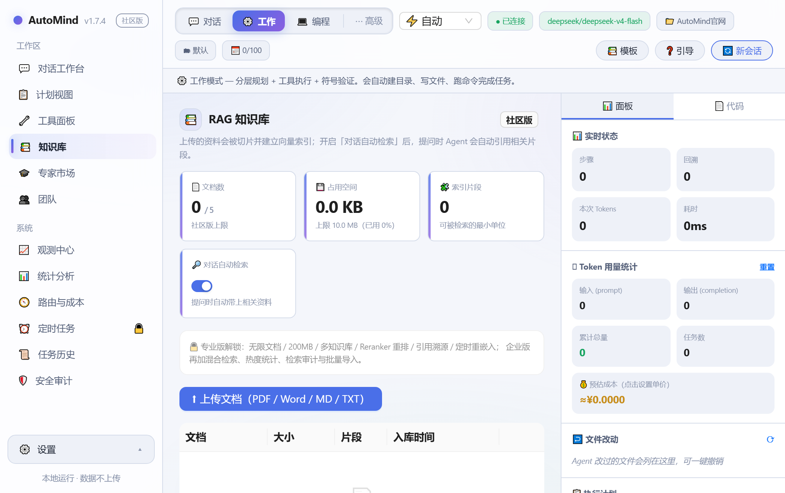

<div align="center">

# AutoMind

**General-Purpose Automation Agent Framework · Community Edition**

Chat, get work done, write code — a local agent workbench that plans, calls tools, and corrects itself.

[](https://github.com/yl13571844594-arch/AutoMind/actions/workflows/ci.yml)
[](https://pypi.org/project/automind-agent/)
[](https://pypi.org/project/automind-agent/)
[](LICENSE)
[](https://pepy.tech/project/automind-agent)
[](https://github.com/yl13571844594-arch/AutoMind/releases/latest)
[](https://github.com/yl13571844594-arch/AutoMind/releases/latest)

[中文](README.md) · [User Manual (zh)](使用手册.md) · [Changelog](CHANGELOG.md) · [Download installers](https://github.com/yl13571844594-arch/AutoMind/releases/latest)

</div>



AutoMind combines the core capabilities of Claude Code, OpenAI Codex, and Reasonix:
MCP protocol support, a Skill system, hierarchical planning, symbolic reasoning, and
self-correction. It ships a built-in **Web workbench** — since v1.0 a modern
React 18 + TypeScript + Ant Design app (sources in `web/`, prebuilt assets bundled so
it works out of the box) — for chatting, working, and coding, plus a
**📚 RAG knowledge base**: upload documents and answers cite them automatically.

> **Your data stays on your machine.** Model API keys live in a local config file,
> task history in a local SQLite database, knowledge-base vectors in a local directory.
> Nothing is sent anywhere except the model provider you configured yourself.

## Screenshots

<table>
<tr>
<td width="50%"><br>
<b>🔧 Tools panel</b> — 31 built-in tools plus skills, MCP servers and plugins, labelled by origin, searchable and toggleable</td>
<td width="50%"><br>
<b>📈 Observability</b> — a live execution DAG of the current task; see what every step is doing</td>
</tr>
<tr>
<td width="50%"><br>
<b>📋 Plan view</b> — hierarchical goal tree with per-step status, preconditions and expected results</td>
<td width="50%"><br>
<b>📚 RAG knowledge base</b> — drop documents in, chat answers retrieve and cite them</td>
</tr>
</table>

## Editions: Community / Pro / Enterprise

This repository is the **Community Edition** (MIT, free). Commercial capabilities ship
as a separate closed-source `automind-pro` package that activates at runtime once a
license is configured — see [docs/EDITIONS.md](docs/EDITIONS.md).

| Capability | Community (free, open source) | Pro | Enterprise |
|------------|:---:|:---:|:---:|
| 💬 Chat / ⚙️ Work / 💻 Coding modes | ✅ | ✅ | ✅ |
| Tools / skills / MCP / plugin system | ✅ | ✅ | ✅ |
| Hierarchical planning · symbolic reasoning · self-correction · memory | ✅ | ✅ | ✅ |
| Web workbench + CLI + autonomous task loop | ✅ | ✅ | ✅ |
| Tool approval · security audit · auth / rate limiting / redaction | ✅ | ✅ | ✅ |
| Basic statistics (tasks / success rate / tokens / tool ranking) | ✅ | ✅ | ✅ |
| 📚 RAG knowledge base (chunking / embedding / auto-retrieval) | 5 docs · 10 MB | unlimited · 200 MB | unlimited |
| 📚 Multi-KB · reranker · citation tracing · scheduled re-embedding | — | ✅ | ✅ |
| 📚 Hybrid retrieval · usage analytics · retrieval audit · bulk import | — | — | ✅ |
| ⚡ Semantic cache (instant answers to similar questions, saves tokens) | — | ✅ basic | ✅ advanced |
| 🧭 Model routing (pick a model by task complexity) | — | ✅ 2 tiers | ✅ N tiers |
| 💰 Cost dashboard (per-model cost / cache savings) | — | — | ✅ |
| 📏 Daily tasks / workspaces | 100 · 3 | unlimited · 30 | unlimited |
| 🤝 Multi-agent mode | — | ✅ | ✅ |
| 🔁 Loop mode (Loop Engineering) | — | ✅ | ✅ |
| ⏰ Scheduled tasks | — | ✅ | ✅ |
| 📊 Advanced statistics dashboard (hit rate / efficiency / trends) | — | ✅ | ✅ |
| 📈 Observability (execution DAG + live board) | current task DAG (read-only) | + board / 200 runs / export | + per-session · 2000 runs |
| ⭐ Custom templates (reusable prompt assets) | — | ✅ | ✅ |
| 📄 Audit report export (PDF) | — | ✅ | ✅ |
| 🎓 Expert profiles | basic (3) | ✅ unlimited / share / import / stats | ✅ |
| 🏛️ Enterprise expert marketplace (approval workflow) | — | — | ✅ |
| 👥 Multi-user session pool (execution isolation) | — | — | ✅ |
| 🔐 SSO / LDAP integration | — | — | ✅ |
| 🧩 Fine-grained permissions (RBAC) | — | — | ✅ |
| 🚪 Private model gateway (egress control, model allowlist) | — | — | ✅ |
| Standalone analytics service | — | — | ✅ |

> Security features (auth, rate limiting, secret redaction, audit) **all stay in the
> Community Edition** — security is never behind a paywall.

## Five Interaction Modes

| Mode | Description | Best for |
|------|-------------|----------|
| 💬 **Chat** | Pure multi-turn conversation, no tool calls, fastest (supports image input / vision models) | Q&A, consulting, brainstorming |
| ⚙️ **Work** | Hierarchical planning + tool execution + symbolic verification | Scaffolding projects, running commands, editing files |
| 💻 **Coding** | ReAct think-act loop focused on code | Reading / writing / debugging / refactoring / testing |
| 🤝 **Multi-agent** (Pro) | Several role agents collaborate, then synthesize | Complex, cross-role, long-running tasks |
| 🔁 **Loop** (Pro) | Loop Engineering: autonomous act–observe–correct cycle | Tasks needing iteration until a target is met |

## Tool Approval Modes

The dropdown at the top switches the approval policy for tool calls
(Reasonix-style `deny > ask > allow` gating):

- 🙋 **Ask** — every non-read-only tool call needs manual approval.
- ⚡ **Auto** (default) — low-risk tools are approved automatically; only dangerous
  operations need confirmation.
- ✅ **Approve all** — skip approval entirely and run fully autonomously (use with care).

## Loop Engineering / Scheduling / Statistics

- **Loop mode** (Pro) has built-in stop conditions (task complete / no progress for N
  rounds / max rounds) plus manual interruption, so it cannot spin forever.
- **⏰ Scheduled tasks** (Pro): run a task at a fixed interval in any mode, scheduled in
  the background with results recorded.
- **📊 Statistics**: the Community Edition provides basic aggregation (task count,
  success rate, tokens, duration, tool ranking); hit-rate donuts, context-usage and
  efficiency trends are Pro.
- **📈 Observability**: draws execution as a live DAG (task → plan step → tool call)
  with status colouring, durations and failure reasons, so you can see exactly where the
  agent is stuck. Community shows the **current task**'s live DAG (read-only); Pro adds a
  live board (success rate / P50·P95 / tool heat / failure attribution), run history and
  export; Enterprise adds per-session grouping.

## Quick Start

```bash
# Option A: download a desktop installer (recommended, no Python required)
#   https://github.com/yl13571844594-arch/AutoMind/releases/latest
#   Windows .exe (code-signed) · macOS .dmg (universal) · Linux .deb

# Option B: install from source
git clone https://github.com/yl13571844594-arch/AutoMind.git
cd AutoMind
pip install -e ".[web]"

# Option C: install from PyPI
pip install "automind-agent[web]"     # Web + OpenAI-compatible backends
# Upgrade: pip install -U "automind-agent[web]"; use [full] for every backend
```

> ⚠️ **PyPI currently lags behind this repository.** The newest release on PyPI is
> `1.3.2` because the project's PyPI Trusted Publisher registration is still pending;
> the packages themselves build and pass audit on every release. Until that is resolved,
> use the installers or a source install to get the latest version.

```bash
# Start the Web workbench (recommended)
python -m automind.server --port 8765
# then open http://localhost:8765

# Windows one-click launcher
launch.bat

# CLI interactive mode (Rich REPL)
automind
automind "your task description"
automind --version
```

### Docker

```bash
docker compose up --build
# Web UI at http://localhost:8765
```

## Model Configuration

Open the Web workbench and click **⚙ Settings → 🔑 API Keys** (bottom left):

- Supports OpenAI / Claude / DeepSeek / Kimi (Moonshot) / Bailian (Qwen) / Zhipu (GLM) /
  Doubao / Gemini / Grok / Ollama.
- **Custom OpenAI-compatible endpoint (relay / proxy)**: fill in `api_base`
  (e.g. `https://api.your-proxy.com/v1`), a default model and an API key to use any
  service compatible with OpenAI's `/v1/chat/completions`.
- Every provider lets you type an arbitrary model name.
- API keys are stored only in the local `.automind_config.json` and are never uploaded.
  Environment variables work too (`OPENAI_API_KEY`, `DEEPSEEK_API_KEY`,
  `MOONSHOT_API_KEY`, …).

## Project Directory / Tools / Skills / MCP

- **Local project directory**: the 📁 badge at the top right (or Settings → General →
  Browse) picks a local directory as the agent's working root.
- **Custom models**: type a model name and click ➕ Add to persist it in the dropdown
  (per provider, removable).
- **Tools panel** (sidebar 🔧) has three tabs:
  - **Tools** — the built-in tool list with permission tier and risk score.
  - **Skills** — built-in skills plus "load a local skill directory" (scans `.py` files
    for `AbstractSkill` subclasses).
  - **MCP** — add and connect MCP servers (stdio / SSE) and auto-discover their tools
    (requires `pip install mcp`).

## Workspaces / Templates / Theme / Undo

- **🗂 Workspaces**: manage and switch between workspaces from the badge at the top
  right. Each workspace = its own directory + its own context, so tasks never pollute
  each other.
- **📚 Template library**: 10 built-in starter templates (website, scaffolding, bug fix,
  tests, data analysis, scraping, …), one click from the welcome screen or the 📚 button.
  A 4-step onboarding tour runs on first open (replay with ❓).
- **🌓 Light mode**: switch dark/light any time from ⚙ Settings; initialises from your
  system preference.
- **💰 Live cost**: the token panel on the right and every result show estimated spend
  (built-in pricing for mainstream models, customisable).
- **↩️ Undo / rollback**: files the agent changed are listed under "File changes" on the
  right; revert one file or roll back everything.
- **▶ Resume**: after an interruption or error, "Continue this task" picks up where it
  stopped instead of redoing the work.
- **📄 Code editor (Web IDE)**: the 📄 Code tab on the right = file tree + Monaco editor
  + change diff preview. Edit code straight from the browser (Ctrl+S to save, undoable)
  without disturbing the chat.
- **🎓 Expert marketplace**: 10 curated official experts installable in one click, plus
  your own (3 in Community). Once activated every task runs with that role's setup; Pro
  adds unlimited creation, sharing, import/export and statistics.
- **👥 Team collaboration**: a task assignment board plus live activity notifications (you
  get told when a colleague's agent changes a file). Workspaces, templates and experts are
  server-level storage, so one deployment is shared by the team.
- **🔌 Agent integration**: a built-in OpenAI-compatible endpoint
  (`/v1/chat/completions`, SSE streaming). ⚙ Settings → 🔌 Agent integration generates
  ready-made **Continue.dev** (VS Code / JetBrains) and **Cline** configs; any other
  OpenAI client (Zed, …) works the same way.

## Chat History

Chat-mode conversations persist to `.automind/chat_history.json` and are restored on
reload; **🔄 New session** clears the current one. Task history (sidebar 📜) supports
deleting single entries or clearing everything.

## Streaming · Interruption

- **Streaming chat**: chat mode streams token by token over WebSocket with a live cursor.
- **Interruption**: click ■ during execution to genuinely cancel the background task
  (`asyncio.Task` cancellation) — works in chat, work and coding modes.
- Falls back to synchronous REST automatically when WebSocket is unavailable.

## Multimodal · Voice · Preview · Token Stats

- **🪙 Token usage**: the right panel shows input/output tokens per task plus running
  totals and task count, resettable in one click.
- **🔍 HTML preview**: ```html blocks in model output get a "Preview" button that renders
  them in a sandboxed iframe; the right panel lists `.html` files in the project directory
  (`/api/preview/file`, restricted to the project directory to prevent traversal).
- **🎤 Voice input**: the microphone button uses the Web Speech API (Chrome/Edge).
- **📎 Multimodal**: attach images for vision models; images, links and tables in output
  are rendered inline.

## Security Audit

The sidebar's **🛡️ Security audit** shows the risk score and authorisation decision for
every tool call (allowed / needs confirmation / dangerous). Destructive commands
(`rm -rf`, `git push --force`, …) are classified as dangerous and require confirmation.

## Production Deployment / Multi-user

- **Session isolation**: every browser gets its own `session_id`; chat histories are
  invisible to each other and never overwrite (persisted under `.automind/chats/`).
- **Access control** (optional, off by default): once a token is set, every `/api/*` and
  `/ws` request must carry it.

| Env variable | Effect |
|--------------|--------|
| `AUTOMIND_AUTH_TOKEN` | Require `Authorization: Bearer <token>` on all `/api/*` and `/ws` |
| `AUTOMIND_CORS_ORIGINS` | Restrict CORS origins (comma-separated) |
| `AUTOMIND_MAX_CONCURRENT` | Max concurrent tasks (default 8; returns 429 beyond) |
| `AUTOMIND_RATE_LIMIT` | Per-client per-minute limit for `/api/run` (0 = off) |
| `AUTOMIND_REDACT_SECRETS` | Redact API keys / tokens in task output |
| `AUTOMIND_ALLOWED_ORIGINS` | WebSocket `Origin` allowlist |

```bash
export AUTOMIND_AUTH_TOKEN="your-secret-token"
export AUTOMIND_CORS_ORIGINS="https://your-domain.com"
export AUTOMIND_MAX_CONCURRENT="16"
python -m automind.server --host 0.0.0.0 --port 8765
```

The frontend sends `Authorization: Bearer <token>`; WebSocket uses
`ws://host/ws?token=<token>`.

- **Health check**: `GET /api/health` (no auth) returns version, running task count,
  concurrency limit and uptime — for liveness probes and load balancers.

> Note: the Community Edition gives full multi-user isolation for chat mode; work/coding
> execution shares a single agent. **Enterprise** adds a session-agent pool so execution
> is isolated per user too, and can connect to a standalone analytics service. See
> [docs/EDITIONS.md](docs/EDITIONS.md).

## Architecture

```
automind/
├── core/            # types, config, LLM backends, hooks, plugins, logging, edition gating
├── agent.py         # AutoMindAgent — top-level orchestrator
├── planning/        # hierarchical planner, ReAct executor, dependency DAG
├── reflection/      # quality assessment, self-correction, retry / circuit breaker
├── memory/          # short/long-term memory, entity memory, knowledge graph
├── rag/             # knowledge base: parsing, chunking, embedding, retrieval
├── tools/           # terminal, file editing, sandbox, permissions, MCP, office/media/net
├── skills/          # skill system (built-ins + SKILL.md + entry points)
├── context/         # context window management, project indexing, code analysis
├── state/           # checkpoints, human-in-the-loop, resource budgets
├── server.py        # FastAPI web layer (REST + WebSocket)
├── cli/             # CLI + Rich REPL
└── static/dist/     # prebuilt React workbench (sources in web/)
```

## Plugin System

Drop a plugin under `~/.automind/plugins/<name>/`:

```
~/.automind/plugins/my-plugin/
├── plugin.json     # {"name": "my-plugin", "version": "1.0.0", "description": "..."}
└── hooks.py        # def get_hooks() -> AgentHooks
```

```python
from automind.core.hooks import AgentHooks

def get_hooks():
    async def before(task):
        print(f"task starting: {task}")
    return AgentHooks(before_run=before)
```

Four plugins ship built in (`cost_tracker`, `pii_guard`, `task_notify`, `hello_hooks`).
Manage them from the Web UI (Tools panel → 🧩 Plugins) or via `GET /api/plugins` and
`POST /api/plugins/{name}/load|unload`.

## Built-in Skills

12 built-in skills: `project_init`, `code_generator` (generation / completion with syntax
validation and a self-repair pass), `test_runner`, `log_analyzer`, `doc_generator`,
`dep_audit`, `data_insight`, `excel_report`, `doc_batch`, `article_writer`,
`web_research`, `env_doctor` — plus any `SKILL.md` skill packs or Python skills you load.

## Examples

See the [examples/](examples/) directory:

- `01-quick-start` — install, launch, first task
- `02-custom-model` — DeepSeek / Ollama / relay-proxy configuration
- `03-skill-development` — write your own Python skill
- `04-plugin-development` — write a lifecycle-hook plugin

## Demo

```bash
python demo/e2e_demo.py
```

## Development

```bash
pip install -e ".[dev]"
pytest tests/            # full test suite
ruff check .             # lint
cd web && pnpm install && pnpm dev    # frontend dev server
```

## Open Source

- **License**: the Community Edition (all code in this repository) is [MIT](LICENSE) —
  free to use, modify, distribute and sell, as long as the copyright and license notice
  are kept. Provided "as is", without warranty of any kind.
- **Edition boundary**: commercial features (multi-agent / loop / scheduling / advanced
  statistics / session pool) are provided by the closed-source `automind-pro` package and
  are **not in this repository**. The community core talks to it through the stable
  extension protocol in [`automind/core/edition.py`](automind/core/edition.py) and runs
  fully standalone when the extension is absent. Security features stay in Community for good.
- **Privacy**: AutoMind runs locally. API keys and chat history stay on your machine
  (`.automind_config.json` / `.automind/`). No telemetry is collected.
- **Contributing**: see [CONTRIBUTING.md](CONTRIBUTING.md); release history in
  [CHANGELOG.md](CHANGELOG.md).

## Community

| I want to… | Go here |
|---|---|
| 🐛 Report a bug | [New issue](https://github.com/yl13571844594-arch/AutoMind/issues/new?template=bug_report.yml) |
| ✨ Request a feature | [New issue](https://github.com/yl13571844594-arch/AutoMind/issues/new?template=feature_request.yml) |
| 💬 Ask how to use it / unsure if it's a bug | [Discussions](https://github.com/yl13571844594-arch/AutoMind/discussions) |
| 🔒 Report a security vulnerability | [Private channel](https://github.com/yl13571844594-arch/AutoMind/security/advisories/new) — please do not open a public issue |
| 🛠 Contribute code | [Contributing guide](CONTRIBUTING.md) · [Code of conduct](.github/CODE_OF_CONDUCT.md) |

The security policy and threat model (what counts as a vulnerability and what is
by design) is in [SECURITY.md](.github/SECURITY.md).
